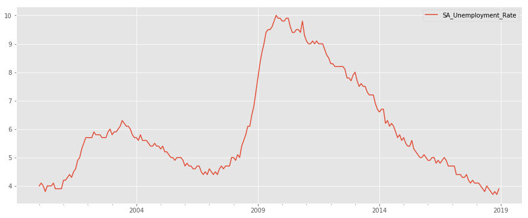
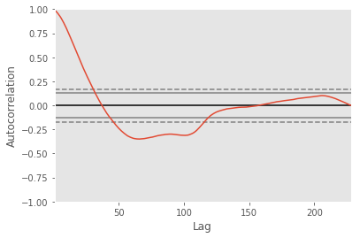
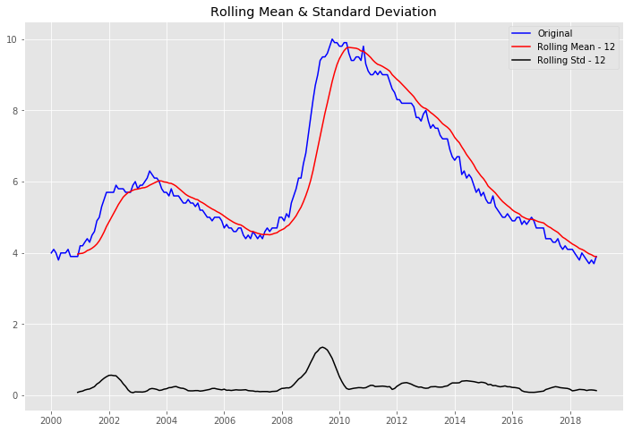
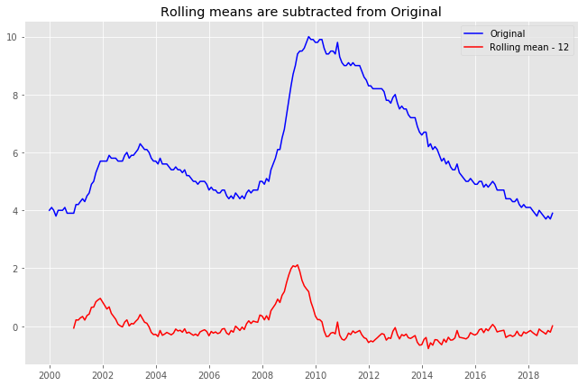
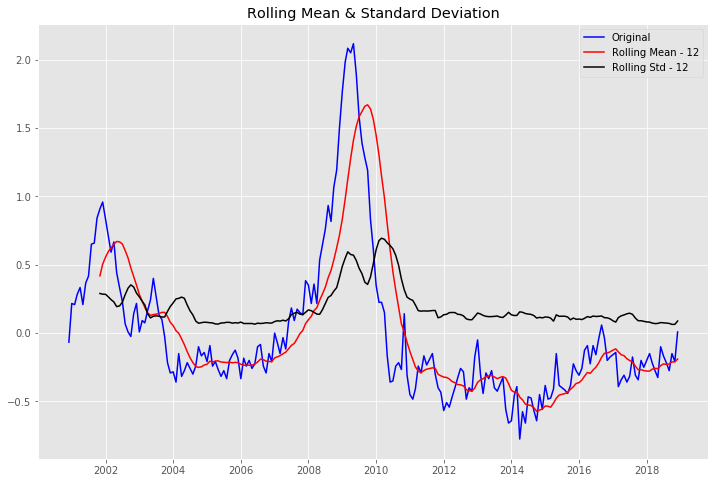
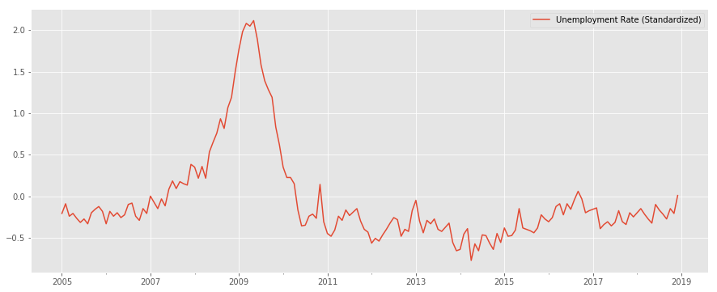
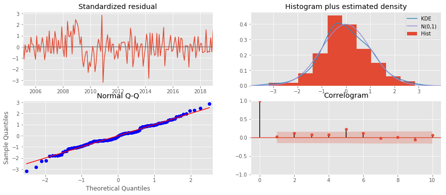
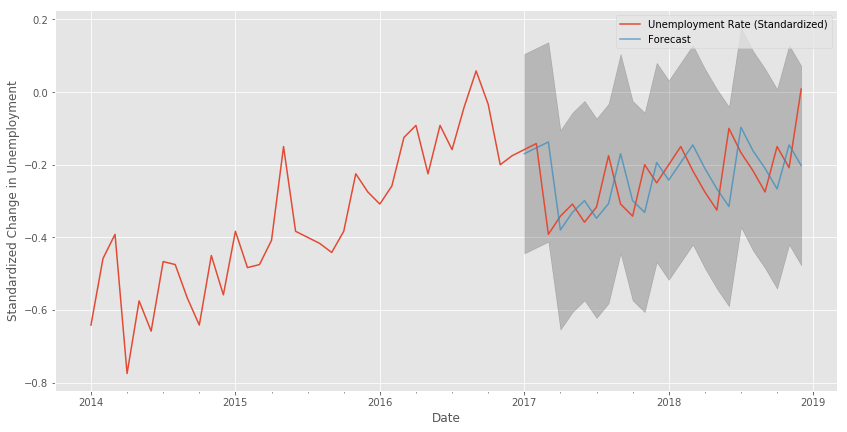
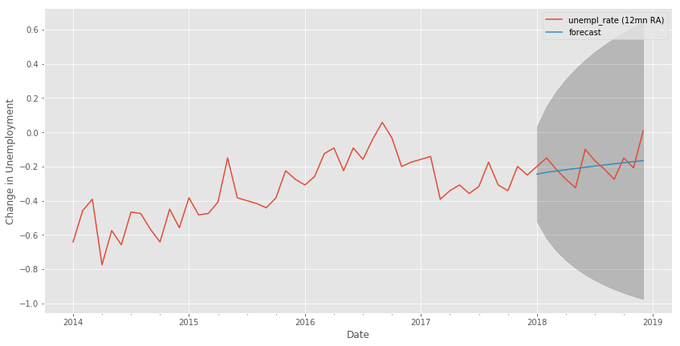
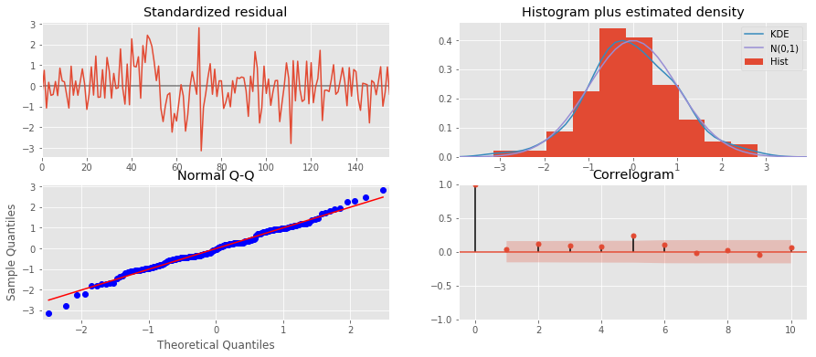

# GOOGLE TRENDS AND THE UNEMPLOYMENT RATE

## Jim Jacisin - Flatiron School

***

## Motivation

*Macroeconomic Metrics:*
- Global: A way to analyze the way the world turns through the way it trades and interacts with its largest members 
- National: Analyzing the economic metrics of a distinct sovereignty to build a picture of fiscal well-being

*The Unemployment Rate:*
- Problem: The U.S. is an enormously complex system
- Solution: Analyze a leading economic indicator and determine if a traditional metric can be improved through big data and machine learning

*Cui Bono?*
- Unemployment Rate and a health economy are highly correlated, predicting a drop in unemployment would help individuals and companies make investing decisions.

*I like this stuff*

***

## Outcome: 

*We can improve our the prediction the unemployment rate by **~25%**, using a SARIMAX model with exogenous job search data*

***

## Project Summary 

*Initial Model*
- Apply an ARIMA time series model to the U.S. unemployment rate to determine to establish a baseline comparison to the other models

*Internet Keyword Model*
- Using Google Trends, obtain information on the frequency of U.S. searches related to the keyword “job”	
- Create an ARIMA time series model using the Google Trend information to determine the predictability of the keyword data

*SARIMAX Exogenous Model*
- Add the job search data as an exogenous variable to the unemployment time series data, a model can be built to improve unemployment forecasting

***


```python
# Import all libraries
import pandas as pd
import numpy as np
from statsmodels.tsa.stattools import adfuller
from statsmodels.tsa.statespace.sarimax import SARIMAX
import matplotlib.pyplot as plt
import itertools
import statsmodels.api as sm
import warnings
warnings.filterwarnings('ignore')
plt.style.use('ggplot')
figsize = [15,6]
from pytrends.request import TrendReq
```

## Initial Unemployment Model


```python
# Pull and format all U.S. Unemployment Data
df = pd.read_excel('dash_package/BLS_SA_Unemployment.xlsx',header=3)
ts_df = df.transpose()
df_UE = ts_df.iloc[1:]
df_UE.columns = ["SA_Unemployment_Rate"]
date_rng = pd.date_range(start='1/1/1948', end='12/31/2018', freq='MS')
df_UE.index = date_rng
df_UE = df_UE['2000-01-01':]
df_UE.head()
```


<div>
<style scoped>
    .dataframe tbody tr th:only-of-type {
        vertical-align: middle;
    }

    .dataframe tbody tr th {
        vertical-align: top;
    }

    .dataframe thead th {
        text-align: right;
    }
</style>
<table border="1" class="dataframe">
  <thead>
    <tr style="text-align: right;">
      <th></th>
      <th>SA_Unemployment_Rate</th>
    </tr>
  </thead>
  <tbody>
    <tr>
      <th>2000-01-01</th>
      <td>4</td>
    </tr>
    <tr>
      <th>2000-02-01</th>
      <td>4.1</td>
    </tr>
    <tr>
      <th>2000-03-01</th>
      <td>4</td>
    </tr>
    <tr>
      <th>2000-04-01</th>
      <td>3.8</td>
    </tr>
    <tr>
      <th>2000-05-01</th>
      <td>4</td>
    </tr>
  </tbody>
</table>
</div>


```python
# Initial Data Plot
df_UE.plot(figsize=figsize)
```


    <matplotlib.axes._subplots.AxesSubplot at 0x1c1da20748>





```python
pd.plotting.autocorrelation_plot(df_UE)
```


    <matplotlib.axes._subplots.AxesSubplot at 0x1c21470e10>





- Autocorrelation --> Matching our feature and time. How closely is the information given by time equal to the target feature
- Shows there is a high level of positive correlation between recent periods and negative correlation around 40 - 95 labs, but tends to center around the 0 mean
- Need to perform standardization to smooth correlation


```python
# Create plot to determine stationarity of a timeseries
def test_stationarity(timeseries,window=12):

    #Determing rolling statistics
    rolmean = timeseries.rolling(window).mean()
    rolstd = timeseries.rolling(window).std()

    #Plot rolling statistics:
    fig = plt.figure(figsize=(12, 8))
    orig = plt.plot(timeseries, color='blue',label='Original')
    mean = plt.plot(rolmean, color='red', label='Rolling Mean - {}'.format(str(window)))
    std = plt.plot(rolstd, color='black', label = 'Rolling Std - {}'.format(str(window)))
    plt.legend(loc='best')
    plt.title('Rolling Mean & Standard Deviation')
    plt.show()
    
    #Perform Dickey-Fuller test:
    print('Results of Dickey-Fuller Test:')
    dftest = adfuller(timeseries, autolag='AIC')
    dfoutput = pd.Series(dftest[0:4], index=['Test Statistic','p-value','#Lags Used','Number of Observations Used'])
    for key,value in dftest[4].items():
        dfoutput['Critical Value (%s)'%key] = value
    print(dfoutput)
```


```python
test_stationarity(df_UE.SA_Unemployment_Rate)
```





    Results of Dickey-Fuller Test:
    Test Statistic                  -2.327888
    p-value                          0.163131
    #Lags Used                       6.000000
    Number of Observations Used    221.000000
    Critical Value (1%)             -3.460291
    Critical Value (5%)             -2.874709
    Critical Value (10%)            -2.573789
    dtype: float64


- Test Statistic/p-value vs. Critical Values
    - Statistical test to determine the amount of confidence the information
    - If the Test Statistic is less than a given Critical Value, we can be X% confident the data set is stationary 


- The Test Statistic is much higher than the Critical Values, therefore the data needs to be manipulated to become more stationary


```python
# Apply 12 month Rolling Mean to our dataset
def use_rol_mean(pd_series, window=12):
    rolmean = pd_series.rolling(window).mean()
    data_minus_rolmean = pd_series - rolmean
    # Adding in rolmean creates NaNs for first year
    data_minus_rolmean.dropna(inplace=True)

    # Plot rollingmean
    fig = plt.figure(figsize=(11,7))
    orig = plt.plot(pd_series, color='blue',label='Original')
    plt.plot(data_minus_rolmean, color='red',label='Rolling mean - {}'.format(str(window)))
    plt.legend(loc='best')
    plt.title('Rolling means are subtracted from Original')
    plt.show(block=False)
    return data_minus_rolmean
```


```python
df_UE_rol_mean = use_rol_mean(df_UE,12)
```





```python
test_stationarity(df_UE_rol_mean.SA_Unemployment_Rate)
```





    Results of Dickey-Fuller Test:
    Test Statistic                  -3.206588
    p-value                          0.019607
    #Lags Used                       6.000000
    Number of Observations Used    210.000000
    Critical Value (1%)             -3.461879
    Critical Value (5%)             -2.875404
    Critical Value (10%)            -2.574159
    dtype: float64


- Test Statistic is below the 95% Critical Value threshold and we can say with 95%+ certainty that our data is stationary


```python
# Reformatting Data for Time Series Analysis
df_UE_rol_mean['SA_Unemployment_Rate'] = pd.to_numeric(df_UE_rol_mean.SA_Unemployment_Rate,downcast='float')
df_UE_rol_mean.columns = ['Unemployment Rate (Standardized)']
df_UE = df_UE_rol_mean['2005-01-01':]
df_UE.head()
```


<div>
<style scoped>
    .dataframe tbody tr th:only-of-type {
        vertical-align: middle;
    }

    .dataframe tbody tr th {
        vertical-align: top;
    }

    .dataframe thead th {
        text-align: right;
    }
</style>
<table border="1" class="dataframe">
  <thead>
    <tr style="text-align: right;">
      <th></th>
      <th>Unemployment Rate (Standardized)</th>
    </tr>
  </thead>
  <tbody>
    <tr>
      <th>2005-01-01</th>
      <td>-0.208333</td>
    </tr>
    <tr>
      <th>2005-02-01</th>
      <td>-0.091667</td>
    </tr>
    <tr>
      <th>2005-03-01</th>
      <td>-0.241667</td>
    </tr>
    <tr>
      <th>2005-04-01</th>
      <td>-0.208333</td>
    </tr>
    <tr>
      <th>2005-05-01</th>
      <td>-0.266667</td>
    </tr>
  </tbody>
</table>
</div>


```python
df_UE.plot(figsize=figsize)
```


    <matplotlib.axes._subplots.AxesSubplot at 0x1c204270b8>





***

### Unemployment ARIMA Model

**The function below represents an ARIMA model that cycles through a given range of p,d,q terms, which account for seasonality, trend and order.**


```python
def arima_modeler(data,pdq_lower,pdq_upper,m):
    p = d = q = range(pdq_lower, pdq_upper)
    pdq = list(itertools.product(p, d, q))
    pdqs = [(x[0], x[1], x[2], m) for x in list(itertools.product(p, d, q))]
    ans = []
    for comb in pdq:
        for combs in pdqs:
            try:
                mod = sm.tsa.statespace.SARIMAX(data,
                                                order=comb,
                                                seasonal_order=combs,
                                                enforce_stationarity=False,
                                                enforce_invertibility=False)

                output = mod.fit()
                ans.append([comb, combs, output.aic])
            except:
                print('except')
                continue
    ans_df = pd.DataFrame(ans, columns=['pdq', 'pdqs', 'aic'])
    ans_df.loc[ans_df['aic'].idxmin()]
    ARIMA_MODEL = sm.tsa.statespace.SARIMAX(data,
                                order=ans_df.loc[ans_df['aic'].idxmin()][0],
                                seasonal_order=ans_df.loc[ans_df['aic'].idxmin()][1],
                                enforce_stationarity=False,
                                enforce_invertibility=False)
    output = ARIMA_MODEL.fit()
    print(output.summary().tables[1])
    return output
```


```python
df_UE_model_output = arima_modeler(df_UE,0,3,12)
```

    ==============================================================================
                     coef    std err          z      P>|z|      [0.025      0.975]
    ------------------------------------------------------------------------------
    ar.L1          0.9695      0.015     64.950      0.000       0.940       0.999
    sigma2         0.0196      0.002     10.109      0.000       0.016       0.023
    ==============================================================================


### Test Results Section

**Diagnostic information related to the Unemployment Rate ARIMA Model**


```python
df_UE_model_output.plot_diagnostics(figsize=figsize)
```





### Forecast Table & Accuracy Results


```python
pred = df_UE_model_output.get_prediction(start=pd.to_datetime('2017-01-01'), dynamic=False)
pred_ci = pred.conf_int()
ax = df_UE_input['2014':].plot(label='observed')
pred.predicted_mean.plot(ax=ax, label='Forecast', alpha=.7, figsize=(14, 7))
ax.fill_between(pred_ci.index,
                pred_ci.iloc[:, 0],
                pred_ci.iloc[:, 1], color='k', alpha=.2)
ax.set_xlabel('Date')
ax.set_ylabel('Standardized Change in Unemployment')
plt.legend()
plt.show()
```





```python
def mean_absolute_percentage_error(y_pred, y_true): 
    y_true, y_pred = np.array(y_true), np.array(y_pred)
    return np.mean(np.abs((y_true - y_pred) / y_true))
```


```python
y_forecasted = np.array(pred.predicted_mean)
y_truth = np.array(df_UE_input['2018-01-01':])
mse = ((y_forecasted - y_truth) ** 2).mean()
print('The Mean Squared Error is {}'.format(round(mse, 5)))
print('The Root Mean Squared Error is {}'.format(round(np.sqrt(mse), 5)))
print('The Mean Average Percent Error is {}'.format(round(mean_absolute_percentage_error(y_forecasted,y_truth), 5)))
```

    The Mean Squared Error is 0.01499
    The Root Mean Squared Error is 0.12245
    The Mean Average Percent Error is 2.83425


**OBSERVATION: Our inital model is generally off about 2.83% of the observed Unemployment Rate**

## SARIMAX Model


```python
# Combine Dataframes
df_ue_js = df_UE.join(df_job)
# Rename Columns
df_ue_js.columns = ['unempl_rate (12mn RA)','prev_mon_job_search_rate']
```


```python
# Parse Data for Review
training_range_end = '2017-12-31'
testing_range_start = '2018-01-01'
testing_range_end = '2018-12-31'

ts_train = df_ue_js.loc[:training_range_end,df_ue_js.columns[0]]
ts_test = df_ue_js.loc[testing_range_start:,df_ue_js.columns[0]].values
ex_train = df_ue_js.loc[:training_range_end,df_ue_js.columns[1]].values
ex_test = df_ue_js.loc[testing_range_start:,df_ue_js.columns[1]].values

data1 = ts_train.values
exog1 = ex_train
```


```python
# PDQ Checker
p = d = q = range(0, 2)
pdq = list(itertools.product(p, d, q))
pdqs = [(x[0], x[1], x[2], 12) for x in list(itertools.product(p, d, q))]

# Find best order/seasonal_order params
ans = []
for comb in pdq:
    for combs in pdqs:
        try:
            mod = sm.tsa.statespace.SARIMAX(data1,
                                            exog=exog1,
                                            order=comb,
                                            seasonal_order=combs,
                                            enforce_stationarity=False,
                                            enforce_invertibility=False)
            output = mod.fit()
            ans.append([comb, combs, output.aic])
            print('ARIMA {} x {}12 : AIC Calculated ={}'.format(comb, combs, output.aic))
        except:
            continue

            
ans_df = pd.DataFrame(ans, columns=['pdq', 'pdqs', 'aic'])
```

    ARIMA (0, 0, 0) x (0, 0, 0, 12)12 : AIC Calculated =282.5187624443979
    ARIMA (0, 0, 0) x (0, 0, 1, 12)12 : AIC Calculated =249.2178803400861
    ARIMA (0, 0, 0) x (0, 1, 0, 12)12 : AIC Calculated =298.2380763122134
    ARIMA (0, 0, 0) x (0, 1, 1, 12)12 : AIC Calculated =277.99908485461367
    ARIMA (0, 0, 0) x (1, 0, 0, 12)12 : AIC Calculated =249.7113504560859
    ARIMA (0, 0, 0) x (1, 0, 1, 12)12 : AIC Calculated =248.575737989875
    ARIMA (0, 0, 0) x (1, 1, 0, 12)12 : AIC Calculated =284.0488554973011
    ARIMA (0, 0, 0) x (1, 1, 1, 12)12 : AIC Calculated =269.80471052799123
    ARIMA (0, 0, 1) x (0, 0, 0, 12)12 : AIC Calculated =120.04720057870655
    ARIMA (0, 0, 1) x (0, 0, 1, 12)12 : AIC Calculated =103.228711107537
    ARIMA (0, 0, 1) x (0, 1, 0, 12)12 : AIC Calculated =159.0031108838009
    ARIMA (0, 0, 1) x (0, 1, 1, 12)12 : AIC Calculated =143.39903030799627
    ARIMA (0, 0, 1) x (1, 0, 0, 12)12 : AIC Calculated =105.2557637028647
    ARIMA (0, 0, 1) x (1, 0, 1, 12)12 : AIC Calculated =104.43273217996366
    ARIMA (0, 0, 1) x (1, 1, 0, 12)12 : AIC Calculated =155.2521714433191
    ARIMA (0, 0, 1) x (1, 1, 1, 12)12 : AIC Calculated =138.00703402554376
    ARIMA (0, 1, 0) x (0, 0, 0, 12)12 : AIC Calculated =-156.7099909597312
    ARIMA (0, 1, 0) x (0, 0, 1, 12)12 : AIC Calculated =-152.04226035738085
    ARIMA (0, 1, 0) x (0, 1, 0, 12)12 : AIC Calculated =-10.113321170898779
    ARIMA (0, 1, 0) x (0, 1, 1, 12)12 : AIC Calculated =-93.55531191591297
    ARIMA (0, 1, 0) x (1, 0, 0, 12)12 : AIC Calculated =-143.822867785536
    ARIMA (0, 1, 0) x (1, 0, 1, 12)12 : AIC Calculated =-154.41008738086316
    ARIMA (0, 1, 0) x (1, 1, 0, 12)12 : AIC Calculated =-44.4084147577535
    ARIMA (0, 1, 0) x (1, 1, 1, 12)12 : AIC Calculated =-90.77112101357005
    ARIMA (0, 1, 1) x (0, 0, 0, 12)12 : AIC Calculated =-153.81453789624788
    ARIMA (0, 1, 1) x (0, 0, 1, 12)12 : AIC Calculated =-147.80086246274251
    ARIMA (0, 1, 1) x (0, 1, 0, 12)12 : AIC Calculated =-7.619955438796879
    ARIMA (0, 1, 1) x (0, 1, 1, 12)12 : AIC Calculated =-90.33392415835402
    ARIMA (0, 1, 1) x (1, 0, 0, 12)12 : AIC Calculated =-141.84721983399965
    ARIMA (0, 1, 1) x (1, 0, 1, 12)12 : AIC Calculated =-149.83856023706255
    ARIMA (0, 1, 1) x (1, 1, 0, 12)12 : AIC Calculated =-42.466164840412745
    ARIMA (0, 1, 1) x (1, 1, 1, 12)12 : AIC Calculated =-87.53968556819868
    ARIMA (1, 0, 0) x (0, 0, 0, 12)12 : AIC Calculated =-158.35563407730464
    ARIMA (1, 0, 0) x (0, 0, 1, 12)12 : AIC Calculated =-134.65646268292812
    ARIMA (1, 0, 0) x (0, 1, 0, 12)12 : AIC Calculated =-13.371366100955349
    ARIMA (1, 0, 0) x (0, 1, 1, 12)12 : AIC Calculated =-93.6511224587929
    ARIMA (1, 0, 0) x (1, 0, 0, 12)12 : AIC Calculated =-143.4911673948816
    ARIMA (1, 0, 0) x (1, 0, 1, 12)12 : AIC Calculated =-154.3148358531793
    ARIMA (1, 0, 0) x (1, 1, 0, 12)12 : AIC Calculated =-44.870036736599005
    ARIMA (1, 0, 0) x (1, 1, 1, 12)12 : AIC Calculated =-90.4274657103397
    ARIMA (1, 0, 1) x (0, 0, 0, 12)12 : AIC Calculated =-155.04614193951397
    ARIMA (1, 0, 1) x (0, 0, 1, 12)12 : AIC Calculated =-128.58106746101566
    ARIMA (1, 0, 1) x (0, 1, 0, 12)12 : AIC Calculated =-11.269994580459581
    ARIMA (1, 0, 1) x (0, 1, 1, 12)12 : AIC Calculated =-91.70317717710716
    ARIMA (1, 0, 1) x (1, 0, 0, 12)12 : AIC Calculated =-141.57284049767145
    ARIMA (1, 0, 1) x (1, 0, 1, 12)12 : AIC Calculated =-150.38441925901088
    ARIMA (1, 0, 1) x (1, 1, 0, 12)12 : AIC Calculated =-43.05485131417375
    ARIMA (1, 0, 1) x (1, 1, 1, 12)12 : AIC Calculated =-88.30345003448652
    ARIMA (1, 1, 0) x (0, 0, 0, 12)12 : AIC Calculated =-154.7483574951375
    ARIMA (1, 1, 0) x (0, 0, 1, 12)12 : AIC Calculated =-150.14984025855824
    ARIMA (1, 1, 0) x (0, 1, 0, 12)12 : AIC Calculated =-8.631492042798508
    ARIMA (1, 1, 0) x (0, 1, 1, 12)12 : AIC Calculated =-91.816204279235
    ARIMA (1, 1, 0) x (1, 0, 0, 12)12 : AIC Calculated =-141.4925471956577
    ARIMA (1, 1, 0) x (1, 0, 1, 12)12 : AIC Calculated =-151.61132909090153
    ARIMA (1, 1, 0) x (1, 1, 0, 12)12 : AIC Calculated =-42.257858722399405
    ARIMA (1, 1, 0) x (1, 1, 1, 12)12 : AIC Calculated =-88.83720572265693
    ARIMA (1, 1, 1) x (0, 0, 0, 12)12 : AIC Calculated =-154.23264786115175
    ARIMA (1, 1, 1) x (0, 0, 1, 12)12 : AIC Calculated =-150.11153178448694
    ARIMA (1, 1, 1) x (0, 1, 0, 12)12 : AIC Calculated =-7.775535400883731
    ARIMA (1, 1, 1) x (0, 1, 1, 12)12 : AIC Calculated =-90.70470474323366
    ARIMA (1, 1, 1) x (1, 0, 0, 12)12 : AIC Calculated =-140.4057731394701
    ARIMA (1, 1, 1) x (1, 0, 1, 12)12 : AIC Calculated =-151.43339415167452
    ARIMA (1, 1, 1) x (1, 1, 0, 12)12 : AIC Calculated =-41.436922364635336
    ARIMA (1, 1, 1) x (1, 1, 1, 12)12 : AIC Calculated =-87.34738426884999


```python
# fit model using order/seasonal_order with the lowest AIC scores from previous test
model = SARIMAX(data1, exog=exog1, order=ans_df.loc[ans_df['aic'].idxmin()][0], seasonal_order=ans_df.loc[ans_df['aic'].idxmin()][1])
model_fit = model.fit()

# make forecast
exog2 = ex_test.reshape(ex_test.shape[0],1)
yhat = model_fit.get_forecast(12,exog=exog2,dynamic=False)

# Graph forecast
yhat_df = pd.DataFrame(yhat.predicted_mean, index=pd.date_range(testing_range_start, periods=12, freq='MS'),columns=['forecast'])
yhat_df_ci = pd.DataFrame(yhat.conf_int(), index=pd.date_range(testing_range_start, periods=12, freq='MS'),columns=['ci_low','ci_high'])

fig, ax = plt.subplots()
ax = df_ue_js['unempl_rate (12mn RA)'].loc['2014':].plot(ax=ax)

yhat_df.plot(ax=ax, label='One-step ahead Forecast', figsize=(14, 7))
ax.fill_between(yhat_df_ci.index,
                yhat_df_ci.iloc[:, 0],
                yhat_df_ci.iloc[:, 1], color='k', alpha=.2)

ax.set_xlabel('Date')
ax.set_ylabel('Change in Unemployment')
plt.legend()
plt.show()
```





```python
model_fit.plot_diagnostics(figsize=figsize)
```





```python
# Determine MSE/RMSE
y_forecasted = yhat.predicted_mean
y_truth =  df_ue_js['unempl_rate (12mn RA)'].loc[testing_range_start:]
mse = ((y_forecasted - y_truth) ** 2).mean()
print('The Mean Squared Error of our forecasts is {}'.format(round(mse, 5)))
print('The Root Mean Squared Error of our forecasts is {}'.format(round(np.sqrt(mse), 5)))
print('The Mean Average Percent Error is {}'.format(round(mean_absolute_percentage_error(y_forecasted,y_truth), 5)))
```

    The Mean Squared Error of our forecasts is 0.00653
    The Root Mean Squared Error of our forecasts is 0.0808
    The Mean Average Percent Error is 2.0271


**OBSERVATION: Our job search model is generally off about 2.03% of the Unemployment Rate**

***

# Conclusion

- Our original time series ARIMA model yielded a 2.83% MAPE, and with the addition of 1 month lag job search data our results improved to 2.03%; an improvement of ~25%


- Through the use of additional Google Search data, we can better predict changes in unemployment

# Future Enhancements

- Additional exogenous keyword data:
    - Job Site Index
    - Career


- LSTM Models with exogenous data to drive more robust results


- More Data
    - Time as Google Trends gathers more data
    - Weekly Unemployment/Job Search Information


- Use Facebook Prophet to improve results
